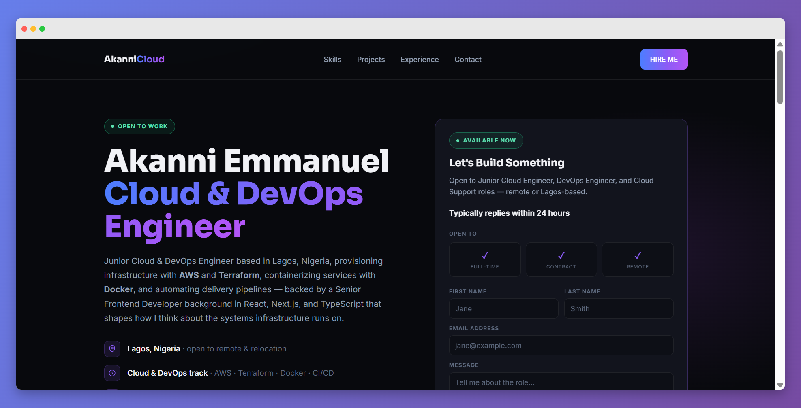
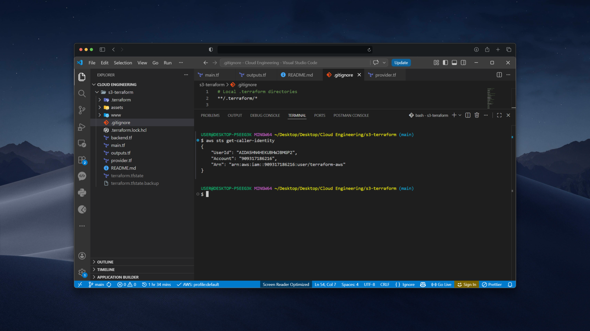
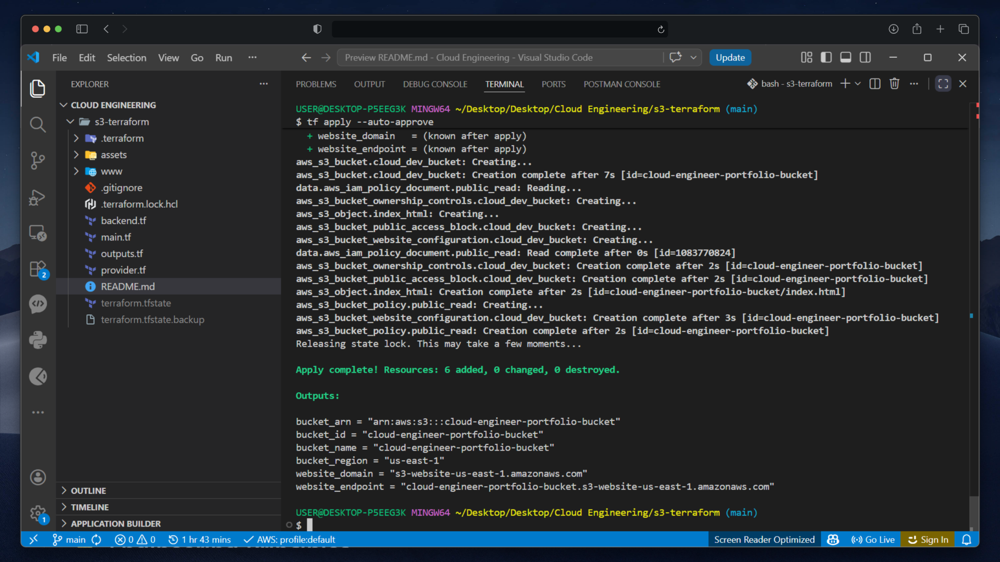

# Terraform AWS Static Website

<p align="center">
  
</p>

<p align="center">
  <strong>Provisioning a secure, production-inspired static website on AWS S3 using Terraform.</strong>
</p>

<p align="center">


</p>

---

## 📖 Overview

This project demonstrates how to provision and manage an AWS S3 static website using **Terraform** while following modern AWS best practices.

Rather than configuring infrastructure manually through the AWS Console, every resource is declared as code, making deployments repeatable, version-controlled, and easy to maintain.

Although the current implementation focuses on Amazon S3, the project is designed to evolve into a complete static website hosting solution incorporating additional AWS services such as CloudFront, Route 53, and ACM.

---

## ✨ Features

* Infrastructure as Code (IaC) with Terraform
* Amazon S3 bucket provisioning
* Static website hosting
* Modern S3 Object Ownership (`BucketOwnerEnforced`)
* Public access configured through Bucket Policies instead of legacy ACLs
* Website endpoint outputs
* Resource tagging
* Clean and modular Terraform configuration
* Easily extensible architecture

---

# 🏗 Architecture

```text
                         Internet
                             │
                             ▼
                   S3 Website Endpoint
                             │
                             ▼
                    Amazon S3 Bucket
                             │
        ┌──────────────┬──────────────┬──────────────┐
        │              │              │
    index.html      styles.css      app.js
        │
        ▼
 Static Website Content

──────────────────────────────────────────────

Infrastructure Managed By

Terraform
     │
     ▼
AWS Provider
     │
     ▼
Amazon S3
```

---

# 📂 Repository Structure

```text
terraform-aws-static-website/

├── main.tf
├── variables.tf
├── outputs.tf
├── providers.tf
├── versions.tf
├── terraform.tfvars
├── .gitignore
├── README.md
│
├── website/
│   ├── index.html
│   ├── error.html
│   ├── styles.css
│   ├── app.js
│   └── assets/
│
├── scripts/
│   └── terraform-alias.sh
│
└── screenshots/
    ├── aws-console.png
    ├── terraform-apply.png
    └── website.png
```

---

# 🛠 Technologies

* Terraform (Latest Version)
* AWS S3
* AWS CLI
* Bash
* Visual Studio Code

---

# 🚀 Getting Started

## Prerequisites

Before deploying the infrastructure, ensure you have the following installed:

* Terraform (Latest Version)
* AWS CLI
* An AWS Account
* Git
* Visual Studio Code (recommended)

Configure AWS credentials using the AWS CLI:

```bash
aws configure
```

Verify authentication:

```bash
aws sts get-caller-identity
```

---

# ⚙ Deployment

Clone the repository

```bash
git clone https://github.com/<your-username>/terraform-aws-static-website.git
```

Move into the project directory

```bash
cd terraform-aws-static-website
```

Initialize Terraform

```bash
terraform init
```

Review the execution plan

```bash
terraform plan
```

Deploy the infrastructure

```bash
terraform apply
```

Destroy resources when finished

```bash
terraform destroy
```

---

# 📤 Outputs

After deployment Terraform outputs useful information such as:

* Bucket Name
* Bucket ARN
* Website Endpoint
* Website Domain
* AWS Region

Example:

```text
website_endpoint = http://bucket-name.s3-website-us-east-1.amazonaws.com
```

---

# 🔒 Security Decisions

This project intentionally follows modern AWS security recommendations.

* Bucket ACLs are disabled.
* Object Ownership is configured using `BucketOwnerEnforced`.
* Access is managed using Bucket Policies instead of ACLs.
* Resources are tagged for easier management.

---

# 📈 Roadmap

## Completed

* [x] Create S3 Bucket
* [x] Configure Bucket Ownership
* [x] Configure Public Access Block
* [x] Enable Static Website Hosting
* [x] Deploy Website Files
* [x] Configure Bucket Policy
* [x] Terraform Outputs

## Planned

* [ ] CloudFront Distribution
* [ ] Route 53 Custom Domain
* [ ] ACM SSL Certificate
* [ ] Remote Terraform State (S3 + DynamoDB)
* [ ] GitHub Actions CI/CD
* [ ] Multiple Environments (dev, staging, production)
* [ ] Reusable Terraform Modules
* [ ] Logging & Monitoring

---

# 📸 Screenshots

## AWS Console

> 
<p align="center">
  
</p>

---

## Terraform Apply

> 

---

## Deployed Website

> 

---

# 💡 Engineering Principles

This project emphasizes several cloud engineering practices:

* Infrastructure as Code
* Repeatable deployments
* Version-controlled infrastructure
* Declarative resource management
* Modern AWS security practices
* Incremental infrastructure evolution
* Clean and maintainable Terraform configuration

---

# 🤝 Contributing

Contributions, suggestions, and improvements are welcome.

If you discover an issue or have an enhancement in mind, feel free to open an issue or submit a pull request.

---

# 👨‍💻 Author

**Akanni Emmanuel**

Cloud Engineer | Software Engineer

GitHub: https://github.com/Harkanni

---

# 📄 License

This project is licensed under the MIT License.

See the `LICENSE` file for more information.

---

## ⭐ Support

If you found this project helpful or interesting, consider giving it a ⭐ on GitHub.

It helps others discover the project and motivates future improvements.
